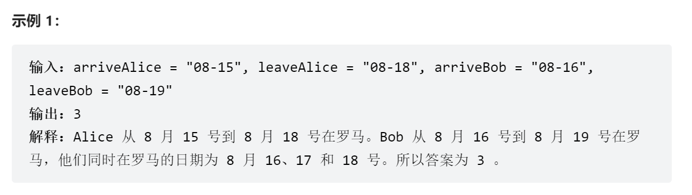

## Leetcode

### 题目：26.删除有序数组中的重复项

> 描述：给你一个**升序**数组`nums`，请你`原地`删除重复出现的元素，使每个元素只出现一次，返回删除后数组的新长度。元素的相对顺序保持一致。
>
> 示例：
>
> 输入：nums = [1,1,2]
>
> 输出：2, nums = [1,2,...]

思路：双指针，left、right指针，循环遍历nums数组，判断退出条件是`right < nums.size()`，若`nums[left] == nums[right]`，右指针右移；若`nums[left] != nums[right]`，左指针右移，并将移动后的位置元素替换为`nums[right]`的元素。

```c++
int removeDuplicates(vector<int>& nums) {
        int s = nums.size();
        int left = 0, right = 0;
        while (right < s) {
            if (nums[left] == nums[right]) {
                right++;
            }
            else {
                nums[++left] = nums[right];
            }
        }
        return left+1;
    }
```

### 题目：[2404. 出现最频繁的偶数元素](https://leetcode.cn/problems/most-frequent-even-element/)

> 描述：给你一个整数数组 `nums` ，返回出现最频繁的偶数元素。
>
> 如果存在多个满足条件的元素，只需要返回 **最小** 的一个。如果不存在这样的元素，返回 `-1` 。
>
> 示例：
>
> 输入：nums = [0,1,2,2,4,4,1]
>
> 输出：2

思路：无序字典，{num:frequency}，记录下每个偶数出现的频次，然后找到最大的频次`max_fre`并记录下来，根据这个`max_fre`遍历字典的values，从而找到所有相同具有最高频词的偶数，然后对其进行排序，取最小的数字。

**方法一：**

```python
def mostFrequentEven(self, nums: List[int]) -> int:
        # 无序字典，记录偶数数字出现的频率{num: frequency}
        dic = defaultdict(int)
        for num in nums:
            if num % 2 == 0:
                dic[num]+=1
        # 判断一下字典是否为空(数组中不包含偶数元素的极端情况)
        if len(dic) == 0:
            return -1
        # 记录下最高的频次
        max_fre = max(dic.values())
        # 比较出同频次下最小的数字
        a = []
        for num, fre in dic.items():
            if fre == max_fre:
                a.append(num)
        a.sort()
        return a[0]
```

**方法二：**

```python
def mostFrequentEven(self, nums: List[int]) -> int:
        dic = Counter([x for x in nums if x % 2 == 0])
        if len(dic) == 0:
            return -1
        max_fre = max(dic.values())
        return min(key for key, value in dic.items() if value == max_fre)
```

> **知识点**
>
> Python collections.Counter用法详解，Counter 计数器，顾名思义就是用来计数的，最主要的作用就是计算“可迭代序列中”各个元素（element）的数量。
>
> 例如：
>
> list_01 = [1,9,9,5,0,8,0,9]
>
> print(Counter(list_01))  #Counter({9: 3, 0: 2, 1: 1, 5: 1, 8: 1})

### 题目：[2405. 子字符串的最优划分](https://leetcode.cn/problems/optimal-partition-of-string/)

> 描述：给你一个字符串 `s` ，请你将该字符串划分成**一个或多个**子字符串 ，并满足每个子字符串中的字符都是 `唯一` 的。也就是说，在单个子字符串中，字母的出现次数都不超过一次 。
>
> 满足题目要求的情况下，返回 `最少` 需要划分多少个子字符串。
>
> 注意，划分后，原字符串中的每个字符都应该恰好属于一个子字符串。
>
> 示例：
>
> 输入：s = "abacaba"
>
> 输出：4
>
> 解释：
>
> ```
> 两种可行的划分方法分别是 ("a","ba","cab","a") 和 ("ab","a","ca","ba") 。
> 可以证明最少需要划分 4 个子字符串。
> ```

思路：labuladong的滑动窗口。设置一个无序字典`dict`，左右指针`left`和`right`，从左向右遍历，遇到重复元素就更新左指针，并将序列分割结果res加一。

```python
def partitionString(self, s: str) -> int:
    	# 若字符串不为空，分割序列默认是1
        res = 1
        if len(s) == 0:
            res = 0
            return res
        dic = defaultdict(int)
        left = 0
        right = 0
        while (right < len(s)):
            c = s[right]
            right+=1
            dic[c]+=1
            if dic[c] >= 2:
                res+=1
                for i in range(left, right-1):
                    dic[s[i]] -= 1
                left = right - 1
        return res 
```

### 题目：[2406. 将区间分为最少组数](https://leetcode.cn/problems/divide-intervals-into-minimum-number-of-groups/)

> 描述：给你一个二维整数数组 intervals ，其中 intervals[i] = [lefti, righti] 表示 闭 区间 [lefti, righti] 。
>
> 你需要将 intervals 划分为一个或者多个区间 组 ，每个区间 只 属于一个组，且同一个组中任意两个区间 不相交 。
>
> 请你返回 最少 需要划分成多少个组。
>
> 如果两个区间覆盖的范围有重叠（即至少有一个公共数字），那么我们称这两个区间是 相交 的。比方说区间 [1, 5] 和 [5, 8] 相交。
>
> 输入：intervals = [[5,10],[6,8],[1,5],[2,3],[1,10]]
> 输出：3
> 解释：我们可以将区间划分为如下的区间组：
>
> - 第 1 组：[1, 5] ，[6, 8] 。
> - 第 2 组：[2, 3] ，[5, 10] 。
> - 第 3 组：[1, 10] 。
> 可以证明无法将区间划分为少于 3 个组。
>

思路：贪心+最小堆。先对intervals中的元素进行按left从小到大进行排序，然后依次遍历，将right值加入到最小堆`h`中。加入规则为：

- 如果当前元素left>最小堆的堆顶元素，则最小堆执行一次pop()+push(right)；
- 否则，直接将left对应的right加入到最小堆中。

循环结束后，最小堆中的元素个数==分组个数。


红色划圈部分为最小堆中的元素。

```python
def minGroups(self, intervals: List[List[int]]) -> int:
        # 贪心+最小堆
        # 先根据left进行排序
        intervals.sort(key=lambda x: x[0])
        # 创建最小堆
        h = []
        for left, right in intervals:
            if h and left > h[0]:
                heapreplace(h, right)
            else:
                heappush(h, right)
        return len(h)
```

> **知识点：**
>
> - sort是序列的内部函数
>
> L.sort(cmp=None, key=None, reverse=False)
>
> 其中cmp和key均接受一个函数，cmp接受布尔值，key接受返回值
>
> - sort中使用lambda
>
> ```python
> a = [('b', 4),('a', 12),('c', 5),('d', 9)]
> a.sort(key=lambda x: x[0])
> ```
>
> 其中lambda是一个匿名函数，是固定写法；x表示匿名函数的输入；x[0]表示匿名函数的输出。
>
> - python中的最小堆
>
> 要创建一个堆，可以使用list来初始化为 `[]` ，或者你可以通过一个函数 [`heapify()`](https://docs.python.org/zh-cn/3/library/heapq.html#heapq.heapify) ，来把一个list转换成堆。
>
> 1. heappush(heap, item)
> 2. heappop(heap)
> 3. heappushpop(heap, item)
> 4. heapify(x)
> 5. heapreplace(heap, item)
>
> 文档参考链接：[heapq--堆队列算法](https://docs.python.org/zh-cn/3/library/heapq.html)

### 题目：[2407. 最长递增子序列 II](https://leetcode.cn/problems/longest-increasing-subsequence-ii/)

> 描述：给你一个整数数组 `nums` 和一个整数 k 。
>
> 找到 `nums` 中满足以下要求的最长子序列：
>
> 1. 子序列 严格递增
>
> 2. 子序列中相邻元素的差值 不超过 k 。
>
> 请你返回满足上述要求的 最长子序列 的长度。
>
> 示例：
>
> 输入：nums = [4,2,1,4,3,4,5,8,15], k = 3
>
> 输出：5
>
> 解释：
>
> 满足要求的最长子序列是 [1,3,4,5,8] 。

思路：动态规划。仿照最长递归子序列I的思路，在判断语句中加入`nums[i] - nums[j] <= k`

时间复杂度：O(N2)

空间复杂度：O(N)

```python
def lengthOfLIS(self, nums: List[int], k: int) -> int:
        nums_size = len(nums)
        dp = [1]*nums_size
        for i in range(0, nums_size):
            for j in range(0, i):
                if nums[i] > nums[j] and nums[i] - nums[j] <= k:
                    dp[i] = max(dp[i], dp[j] + 1)
        return max(dp)
```

但是这个代码运行时间超限，需要进行优化：

- 单调栈 + 二分优化
- 线段树、平衡树等数据结构优化

### 题目：[121. 买卖股票的最佳时机](https://leetcode.cn/problems/best-time-to-buy-and-sell-stock/)

> 描述：给定一个数组 prices ，它的第 i 个元素 prices[i] 表示一支给定股票第 i 天的价格。
>
> 你只能选择 某一天 买入这只股票，并选择在 未来的某一个不同的日子 卖出该股票。设计一个算法来计算你所能获取的最大利润。
>
> 返回你可以从这笔交易中获取的最大利润。如果你不能获取任何利润，返回 0 。
>
> 示例：
>
> 输入：[7,1,5,3,6,4]
> 输出：5

思路：

```python
def maxProfit(self, prices: List[int]) -> int:
        inf = int(1e9)
        minprice = inf
        maxprofit = 0
        for price in prices:
            maxprofit = max(price - minprice, maxprofit)
            minprice = min(price, minprice)
        return maxprofit
```

### 题目：[6182. 反转二叉树的奇数层](https://leetcode.cn/problems/reverse-odd-levels-of-binary-tree/)

> 描述：给你一棵 完美 二叉树的根节点 root ，请你反转这棵树中每个 奇数 层的节点值。
>
> 例如，假设第 3 层的节点值是 [2,1,3,4,7,11,29,18] ，那么反转后它应该变成 [18,29,11,7,4,3,1,2] 。
> 反转后，返回树的根节点。
>
> 完美 二叉树需满足：二叉树的所有父节点都有两个子节点，且所有叶子节点都在同一层。
>
> 节点的 层数 等于该节点到根节点之间的边数。
>


思路：深度优先搜索（DFS）或者前序遍历。

```c++
	TreeNode* reverseOddLevels(TreeNode* root) {
        reverse(root->left, root->right, 1);
        return root;
    }
    void reverse(TreeNode* l, TreeNode* r, int height) {
        if (l == nullptr) {
            return ;
        }
        if (height % 2 != 0) {
            int val = l->val;
            l->val = r->val;
            r->val = val;
        }
        reverse(l->left, r->right, height+1);
        reverse(l->right, r->left, height+1);
    }
```

### 题目：[2409. 统计共同度过的日子数](https://leetcode.cn/problems/count-days-spent-together/)

> 描述：Alice 和 Bob 计划分别去罗马开会。
>
> 给你四个字符串 arriveAlice ，leaveAlice ，arriveBob 和 leaveBob 。Alice 会在日期 arriveAlice 到 leaveAlice 之间在城市里（日期为闭区间），而 Bob 在日期 arriveBob 到 leaveBob 之间在城市里（日期为闭区间）。每个字符串都包含 5 个字符，格式为 "MM-DD" ，对应着一个日期的月和日。
>
> 请你返回 Alice和 Bob 同时在罗马的天数。
>
> 你可以假设所有日期都在 同一个 自然年，而且 不是 闰年。每个月份的天数分别为：[31, 28, 31, 30, 31, 30, 31, 31, 30, 31, 30, 31] 。
>



思路：题目本质上是求两个区间的交集区间。

交集区间的右端点等于两个区间右端点的最小值，左端点等于两个区间左端点的最大值。

注意交集区间为空的情况。

```python3
DAYS_SUM = list(accumulate((31, 28, 31, 30, 31, 30, 31, 31, 30, 31, 30, 31), initial=0))
def cale(data: str) -> int:
    return DAYS_SUM[int(data[:2])-1] + int(data[3:])
class Solution:
    def countDaysTogether(self, arriveAlice: str, leaveAlice: str, arriveBob: str, leaveBob: str) -> int:
        return max(cale(min(leaveAlice, leaveBob)) - cale(max(arriveAlice, arriveBob)) + 1, 0)
```

